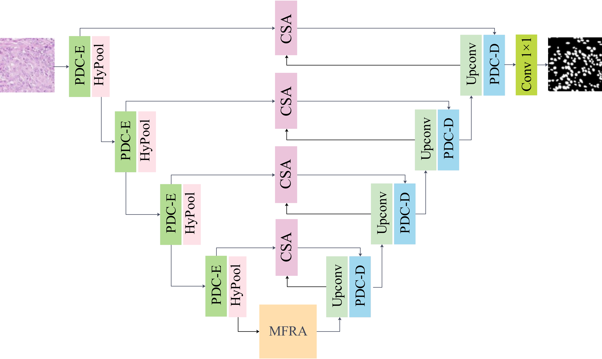

# MLAANet
This is the official repository for 'MLAANet: A Multi-Level Attention-Aware Network for Pathological Nuclei Segmentation'

# Architecture
<p align="center">

</p>

# Dataset Structure
The dataset is organized as follows:

 - `dataset/`
    - `dataset_name/`: Name of the dataset used, such as CMP17, MoNuSeg, PanNuke, CoNIC, and NuInsSeg
        - `train/`: Contains training dataset
          - `imgs/`: Training images
          - `masks/`: Corresponding segmentation masks for training images
        - `test/`: Contains training dataset
          - `imgs/`: Test images
          - `masks/`: Corresponding segmentation masks for test images            
    - `dataset_name/`: Name of the dataset used, such as CMP17, MoNuSeg, PanNuke, CoNIC, and NuInsSeg
       - .......

# Train and Test
Please use Trainer.py to train (mode:1) and to predict (mode:0)

# Datasets
The following datasets are used in this experiment:
<ol>
  <li><a href="https://drive.google.com/drive/folders/1sJ4nmkif6j4s2FOGj8j6i_Ye7z9w0TfA">CPM17</a></li>
  <li><a href="https://monuseg.grand-challenge.org/">MoNuSeg</a></li>
  <li><a href="https://warwick.ac.uk/fac/cross_fac/tia/data/pannuke/">PanNuke</a></li>
  <li><a href="https://conic-challenge.grand-challenge.org/">CoNIC</a></li>
  <li><a href="https://www.kaggle.com/datasets/ipateam/nuinsseg/">NuInsSeg</a></li>
 </ol>
 
# Citation

If you find this work useful in your research, please consider citing our papers:

```bibtex
@article{zhu2026mlaanet,
  title     = {MLAANet: A multi-level attention-aware network for pathological nuclei segmentation},
  author    = {Zhu, Shujin and Li, Yue and Lu, Linsheng and Mao, Tianyi and Yan, Yidan and Dai, Xiubin},
  journal   = {Biomedical Signal Processing and Control},
  volume    = {112},
  pages     = {108716},
  year      = {2026},
  publisher = {Elsevier}
}
```
